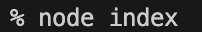
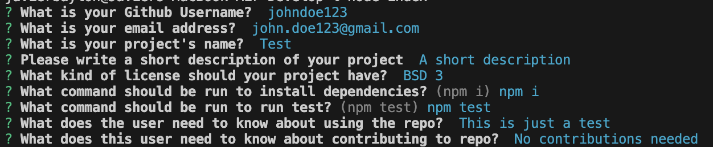

# README Generator

## Table of Contents

If your README is long, add a table of contents to make it easy for users to find what they need.

- [Description](#description)
- [Installation](#installation)
- [Usage](#usage)
- [License](#license)
- [How to Contribute](#how-to-contribute)

## Description

- My motivation for this project is to reduce the time it takes to fill out a README
- I built this project for other users to also take less time to fill out the README
- It is a problem with a simple solution of DRY(Don't repeat yourself).
- I learned a little more about the package inquirer.

## Installation

To install this project, you need a few things first. You need: 

-A bash or zsh terminal
-Node.js installed

## Usage

Open your IDE and navigate to the directory via the terminal of the project. 

Run npm i to install all packages needed.

You are now ready to begin.

Run the the following command in the CLI: "node index"

You will be prompted with a series of questions. 

After you answer them, a read me will generate. 

Success, you have used generated a readme from a few questions. 

## License

MIT License

Copyright (c) 2023 javieb5186

Permission is hereby granted, free of charge, to any person obtaining a copy
of this software and associated documentation files (the "Software"), to deal
in the Software without restriction, including without limitation the rights
to use, copy, modify, merge, publish, distribute, sublicense, and/or sell
copies of the Software, and to permit persons to whom the Software is
furnished to do so, subject to the following conditions:

The above copyright notice and this permission notice shall be included in all
copies or substantial portions of the Software.

THE SOFTWARE IS PROVIDED "AS IS", WITHOUT WARRANTY OF ANY KIND, EXPRESS OR
IMPLIED, INCLUDING BUT NOT LIMITED TO THE WARRANTIES OF MERCHANTABILITY,
FITNESS FOR A PARTICULAR PURPOSE AND NONINFRINGEMENT. IN NO EVENT SHALL THE
AUTHORS OR COPYRIGHT HOLDERS BE LIABLE FOR ANY CLAIM, DAMAGES OR OTHER
LIABILITY, WHETHER IN AN ACTION OF CONTRACT, TORT OR OTHERWISE, ARISING FROM,
OUT OF OR IN CONNECTION WITH THE SOFTWARE OR THE USE OR OTHER DEALINGS IN THE
SOFTWARE.

## How to Contribute

Developers can contribute by adding validation to each response.